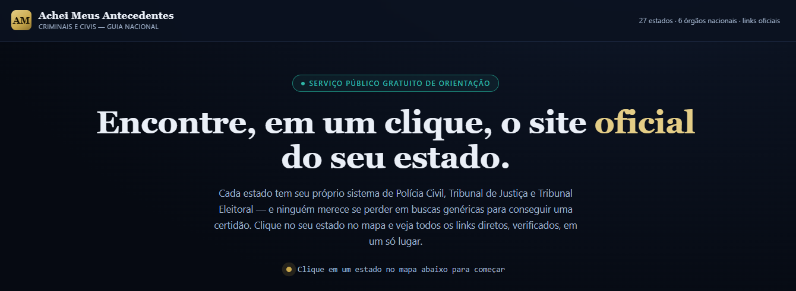
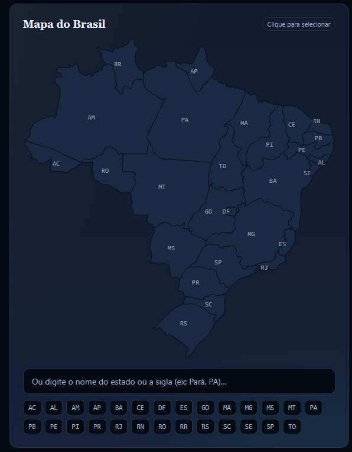
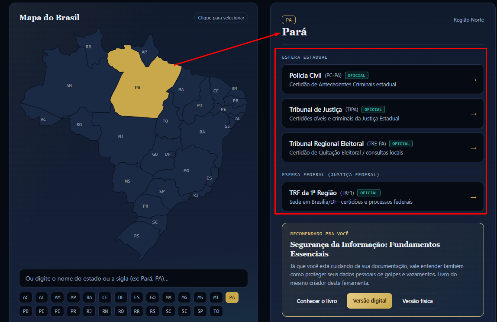
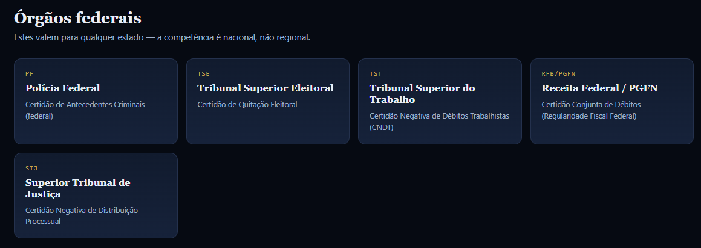

# Achei Meus Antecedentes Criminais e Civis

> Ferramenta gratuita de utilidade pública que reúne, em um único mapa interativo do Brasil, os links **oficiais** para emissão de certidões de antecedentes criminais, civis, eleitorais e federais — por estado.

🔗 **Site no ar:** [antecedentes.guiadasegurancadigital.com.br](https://antecedentes.guiadasegurancadigital.com.br/)

---

## Capturas de tela

**Página inicial**


**Mapa interativo do Brasil**


**Exemplo: estado selecionado (Pará)**


**Órgãos federais**


---

## O problema que resolve

Cada estado brasileiro tem seu próprio órgão responsável pela emissão de antecedentes criminais — e esse órgão **nem sempre se chama "Polícia Civil"**. Em vários estados, quem emite é a Polícia Científica, um Instituto de Identificação, ou um instituto técnico-científico com nome próprio. Cada um tem seu domínio, nome e fluxo diferente. Quem precisa de uma certidão para emprego, concurso ou processo seletivo frequentemente cai em buscas genéricas no Google e acaba em sites de terceiros que cobram por algo **gratuito**, ou pior, em páginas fraudulentas.

Esta ferramenta resolve isso reunindo, em um só lugar, **apenas links verificados manualmente** para domínios `.gov.br` e `.jus.br` oficiais — sem cobrar nada e sem coletar nenhum dado pessoal do visitante. E faz questão de nomear corretamente cada órgão, em vez de generalizar tudo como "Polícia Civil".

## O que está incluído

- **26 estados + Distrito Federal** (as 27 unidades federativas), cada um com:
  - Órgão estadual responsável pela emissão de antecedentes criminais — identificado pelo nome correto em cada caso (ver tabela abaixo)
  - Tribunal de Justiça (certidões cíveis e criminais estaduais)
  - Tribunal Regional Eleitoral (site institucional, notícias e cartórios eleitorais locais)
  - **Certidão de Quitação Eleitoral** — link direto para o Autoatendimento Eleitoral do TSE, sistema nacional único, igual para qualquer estado
  - Tribunal Regional Federal da região correspondente (site institucional)
  - **Certidão da Justiça Federal** — link direto para o Sistema de Certidão Unificada do CJF, que cobre as 5 regiões da Justiça Federal (TRF1 a TRF5) em uma única consulta
- **5 órgãos federais**: Polícia Federal, TSE, TST (CNDT), Receita Federal/PGFN, STJ

### Transparência sobre os órgãos estaduais

Nem todo estado usa "Polícia Civil" como nome do órgão emissor. Os casos abaixo foram confirmados manualmente em fontes oficiais e nomeados de forma precisa na ferramenta:

| Estado | Órgão real (conforme fonte oficial) |
|---|---|
| Alagoas (AL) | Polícia Científica — Instituto de Identificação |
| Amazonas (AM) | Instituto de Identificação Aderson C. de Melo (IIACM) |
| Espírito Santo (ES) | Polícia Científica |
| Mato Grosso (MT) | Politec — Perícia Oficial e Identificação Técnica |
| Mato Grosso do Sul (MS) | Instituto de Identificação "Gonçalo Pereira" |
| Rio de Janeiro (RJ) | Instituto Félix Pacheco (Polícia Técnico-Científica/SEPOL) |
| Rio Grande do Norte (RN) | ITEP — Instituto Técnico-Científico de Polícia |

Nos demais estados, o órgão confirmado é mesmo a Polícia Civil estadual.

### Por que existem dois sistemas nacionais unificados

Dois serviços têm abrangência nacional e não variam por estado — por isso a ferramenta os trata separadamente do site institucional do TRE/TRF de cada UF:

- **Certidão de Quitação Eleitoral**: emitida sempre pelo Autoatendimento Eleitoral do TSE, independente de qual TRE é o do seu estado.
- **Certidão da Justiça Federal**: desde junho de 2024, o CJF unificou a emissão das 5 regiões (TRF1 a TRF5) em um único sistema, com um número de validação nacional.

## Stack

Projeto **single-file**: HTML, CSS e JavaScript puros, sem build step, sem dependências externas de runtime (além de Google Fonts via CDN). O mapa do Brasil é um SVG com paths reais por UF, clicável via JavaScript vanilla.

Por quê: facilita hospedagem em qualquer ambiente simples (neste caso, hospedagem compartilhada Localweb), sem necessidade de pipeline de build.

## Como rodar localmente

Não há dependências de build. Basta abrir o arquivo diretamente:

```bash
git clone https://github.com/pablonoliveira/achei-meus-antecedentes.git
cd achei-meus-antecedentes
# abra index.html no navegador, ou sirva com qualquer servidor estático:
python3 -m http.server 8000
```

## Roadmap

- [x] **v1.0** — Página única (SPA), mapa interativo, 26 estados + Distrito Federal + 6 TRFs + 5 órgãos federais, todos os links verificados manualmente
- [x] **v1.1** — Correção de precisão: nomeação correta do órgão emissor por estado (Polícia Civil, Polícia Científica ou Instituto de Identificação, conforme o caso); separação dos links de Certidão de Quitação Eleitoral (TSE) e Certidão da Justiça Federal (CJF) dos sites meramente institucionais de TRE/TRF
- [ ] **v1.2** — Página dedicada de "última verificação" por estado, com data de checagem de cada link
- [ ] **v2.0** — Uma URL própria por estado (ex: `/antecedentes/sp`), permitindo indexação individual em buscadores e SEO direcionado por estado

Contribuições e correções de link são bem-vindas via issue ou pull request.

## Por que isso é open source

Esse projeto nasceu para ajudar o cidadão brasileiro a não cair em golpe ao tentar emitir uma certidão simples. Faz sentido que o código também seja aberto: qualquer pessoa pode auditar os links, sugerir correções, ou adaptar para outro uso de utilidade pública.

## Licença

Distribuído sob a licença [MIT](LICENSE). Uso, modificação e redistribuição são livres, desde que o aviso de copyright e a licença original sejam mantidos.

## Autor

**Pablo Nunes de Oliveira**
Perito em Computação Forense · Analista de Segurança da Informação · Guia da Segurança Digital

- LinkedIn: [linkedin.com/in/pablonoliveirapro](https://www.linkedin.com/in/pablonoliveirapro)
- Instagram: [@pablonoliveirapro](https://www.instagram.com/pablonoliveirapro)
- Site: [guiadasegurancadigital.com.br](https://www.guiadasegurancadigital.com.br/)
